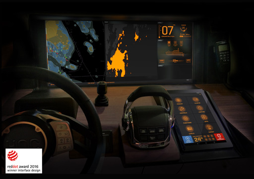

## Projects

### [Yacht Defined](https://www.technocreatives.com/projects/yacht-defined)

 (2016-2019)

Navigation Screen Display:
* Qt/QML Application.
* Developed Menu, Side Panel.
* Radar Integration.

Android Command Screen Home App:
* Written in Java
* Compound Android Views
* MQTT Communication

iPhone Remote Control App:
* Written React Native iOS with Objective C Components
* MQTT Communication
* https://apps.apple.com/us/app/yacht-defined/id1367829276

![Digital TV]

